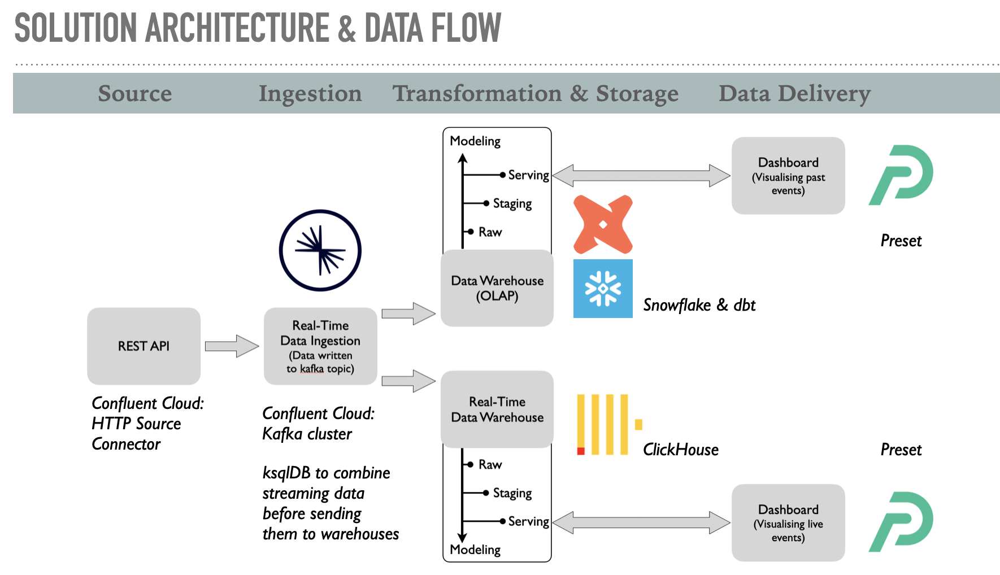
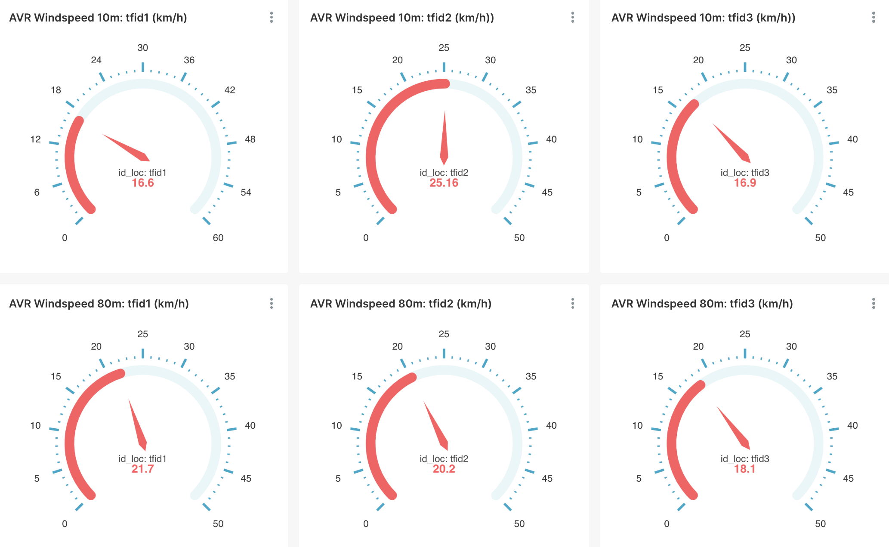
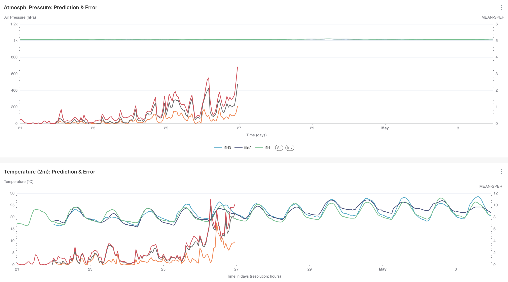

## Introduction

The current project represents a real-world demonstration of a high-performance data pipeline for streaming data (real-time data flows) within a cloud-based environment. This project was developed during the particpation of the data engineering class of [**DEC**](https://dataengineercamp.com/) using an an open-source weather [API](https://open-meteo.com) connection providing high-resolution weather forecasts. The project's challenge was to build a multi-level EXTRACT-LOAD-TRANSFORM (ELT) data pipeline that would allow both, evaluation of incoming real-time data (real-time data warehouse) and the access of past records and derived measures (OLAP data warehouse). Data consumption is designed to be delivered via a given BI-tool such as Preset, Power-BI, Tableau etc. The dataset and research/business questions are both of exemplary nature, while all data engineering techniques used were designed to represent best-in-class methodologies.

## Objective

The goal of the data pipline is to provide records of business transactions to BI analysts so that they can answer three main business questions and additionally can slice- and dice using a range of different attributes within a BI-tool:

The goal of the current data pipline is to provide records of wind profiles from different coastal weather stations that are sampled continuously via API connection (data streaming). These records are be processed and analysed as

+ Historic data (past predictions) and 

+ Live-feed data (most recent sample)

Relevant measures for defining wind profiles contained in the API data are as follows:

- Air temperature (2m, 80m above ground)
- Wind speed (10m, 80m)
- Wind gust (10m)
- Atmospheric pressure
- Wind direction

These values can be used to calculate wind energy production assuming additional paramters of a given production site (e.g. system physical parameters such as rotor length, wind turbine specification etc and system operational parameters). Usualy these models are fed with actual weather data to calculate wind energy production. In our current scenario, we will test the idea to replace actual weather data with weather predictions for a short term interval. If these model input values can be ta from atmospheric forecasts (with reasonable error bounds) wind energy production could be estimated for the near-term future (couple of days ahead).  

## Consumers

The intented consumer is a hypothetical windpower energy supplier receiving wind profile data via a BI tool (dashboard) in order to execute the follwoing tasks:

+ Analyse the predicted wind profiles for different locations (historic data)
+ Evaluate the prediction quality of the forecast (mean squared prediction error) for different locations
+ Monitor live-incoming new wind data

## Source Data

Connecting to the open-source weather [API](https://open-meteo.com) that offers hourly 7-day forecast from more than 5 national weather networks (incl. US, Canada, Germany, France) combining local (1 km resolution) and global (11 km) weather forecasts provides the data source. Given the integration of several weather networks with different refresh rates regarding their meterlogical models the API is used as a real-time data source. 

## Solution Architecture & Data Flow

The following graphical overview shows all components or services that were combined to implement the current streaming data solution. All components are designed to enable a high-performance solution in the cloud.



+ Ingestion: Apache Kafka cluster with a seperate topic for each location (n=3) receiving data on wind profiles via HTTP source connector.
+ Ingestion: using ksqlDB on top of Apache Kafka to create a single data stream from the originally three seperate Kafka topics. 
+ Data Modelling & Data Storage: Snowflake & dbt for keeping and analysing past records and assessing prediction quality of forcasted values (mean squared prediction error).
+ Data Modelling & Data Storage: ClickHouse for real-time data.
+ Data Delivery: Preset connected to both data warehouses (Snowflake and ClickHouse) for dashboard reporting.

## Implementation Details

### Confluent

1. Creating a Kafka topic one for each location (examples topic names: tfs_strc,  ) via establishing a HTTP source connector (connection to API: https://open-meteo.com/)
2. Within ksqlDB: 
   + Define a stream for each Kafka topic (considering the nested json data)
   + Define an overall stream based on one topic and insert the remaining streams (based on the two remaining topics)
   + Include the location id for each individual stream before combing all streams

*SQL code: Creating a stream for each topic* 

```sql
CREATE STREAM strc_stream (
    "latitude" DOUBLE,
    "longitude" DOUBLE,
    "generationtime_ms" DOUBLE,
    "utc_offset_seconds" INTEGER,
    "timezone" VARCHAR,
    "timezone_abbreviation" VARCHAR,
    "elevation" DOUBLE,
    "hourly_units" MAP < VARCHAR, VARCHAR >,
    "hourly" MAP < VARCHAR, VARCHAR >
) WITH (KAFKA_TOPIC = 'tfs_strc', VALUE_FORMAT = 'JSON');
```

```sql
CREATE STREAM pors_stream (
    "latitude" DOUBLE,
    "longitude" DOUBLE,
    "generationtime_ms" DOUBLE,
    "utc_offset_seconds" INTEGER,
    "timezone" VARCHAR,
    "timezone_abbreviation" VARCHAR,
    "elevation" DOUBLE,
    "hourly_units" MAP < VARCHAR, VARCHAR >,
    "hourly" MAP < VARCHAR, VARCHAR >
) WITH (KAFKA_TOPIC = 'tfs_pors', VALUE_FORMAT = 'JSON');
```

```sql
CREATE STREAM adej_stream (
    "latitude" DOUBLE,
    "longitude" DOUBLE,
    "generationtime_ms" DOUBLE,
    "utc_offset_seconds" INTEGER,
    "timezone" VARCHAR,
    "timezone_abbreviation" VARCHAR,
    "elevation" DOUBLE,
    "hourly_units" MAP < VARCHAR, VARCHAR >,
    "hourly" MAP < VARCHAR, VARCHAR >
) WITH (KAFKA_TOPIC = 'tfs_adej', VALUE_FORMAT = 'JSON');
```

*SQL code: Creating unified stream based on one single topic (stream) and inserting data from the two remaining topics (streams). In addition, the timestamp from the Kafka meta information was included in each individual stream (using the function `ROWTIME`):* 

```sql
CREATE STREAM ALL_STREAM WITH (VALUE_FORMAT='JSON') AS 
SELECT 
		TIMESTAMPTOSTRING(ROWTIME, 'yyyy-MM-dd HH:mm:ss.SSS') AS `api_time_formatted`,
			 "latitude",
       "longitude",
       "timezone_abbreviation",
       "elevation",
       'tfid1' AS `idloc`,
       "hourly_units",
       "hourly"
FROM  STRC_STREAM;
```

```sql
INSERT INTO ALL_STREAM 
SELECT 
TIMESTAMPTOSTRING(ROWTIME, 'yyyy-MM-dd HH:mm:ss.SSS') AS `api_time_formatted`,
			 "latitude",
       "longitude",
       "timezone_abbreviation",
       "elevation",
       'tfid2' AS `idloc`,
       "hourly_units",
       "hourly"
FROM  PORS_STREAM;
```

```sql
INSERT INTO ALL_STREAM 
SELECT 
TIMESTAMPTOSTRING(ROWTIME, 'yyyy-MM-dd HH:mm:ss.SSS') AS `api_time_formatted`,
       "latitude",
       "longitude",
       "timezone_abbreviation",
       "elevation",
       'tfid3' AS `idloc`,
       "hourly_units",
       "hourly"
FROM  ADEJ_STREAM;
```

3. Creating sink connectors to load data into 

+ Snowflake and
+ ClickHouse

### dbt/Snowflake: Data Modeling

Data entering Snowflake are transformed through raw/staging/serving layers via dbt modelling. Transformation steps include:

+ Unpacking JSON data into useable format.
+ Calculating mean squared prediction errors for the different measurement types (such as wind speed, air pressure, temperature, etc.) based on the difference between actual values and predicted values.
+ Calculating statistical measures such as sample averages for different  measurement types.

All transformation steps represented by dbt modelling are contained in the current code repository (please see the individual models in project folder).

### ClickHouse
ClickHouse was used as data warehouse to access the real-time data from the Apache Kafka topic: 

Setting up the table in ClickHouse for receiving streaming data:

```sql
SET allow_experimental_object_type=1;
CREATE TABLE conf_windpower
    (
    latitude Float64,
    longitude Float64,
    timezone_abbreviation String,
    elevation Float64,
    idloc String,
    hourly_units JSON,
    hourly JSON,
    _topic String,
    _timestamp DateTime,
    _offset UInt64,
    _partition UInt64
    ) ENGINE = MergeTree ORDER BY (idloc, _timestamp)
```

## Results: Preset Dashboard (Data Delivery)
The Preset dashboard contains several sections each reflecting different data aspects (highlighting only some represenative examples):
+ Live status of latest API requests per location - including the timeline of prior API requests (via connection to ClickHouse): 
+ Summary statistics for windspeed per location: 
+ For each measurement type: Hourly predictions per day together with their mean-squared prediction errors (example: atomospheric pressure and temperature)    

## Current Code Repository
The code shared within this repository reflect the data transformation and modeling part of the pipline that was realized within dbt connected to Snowflake serving as data warehouse.